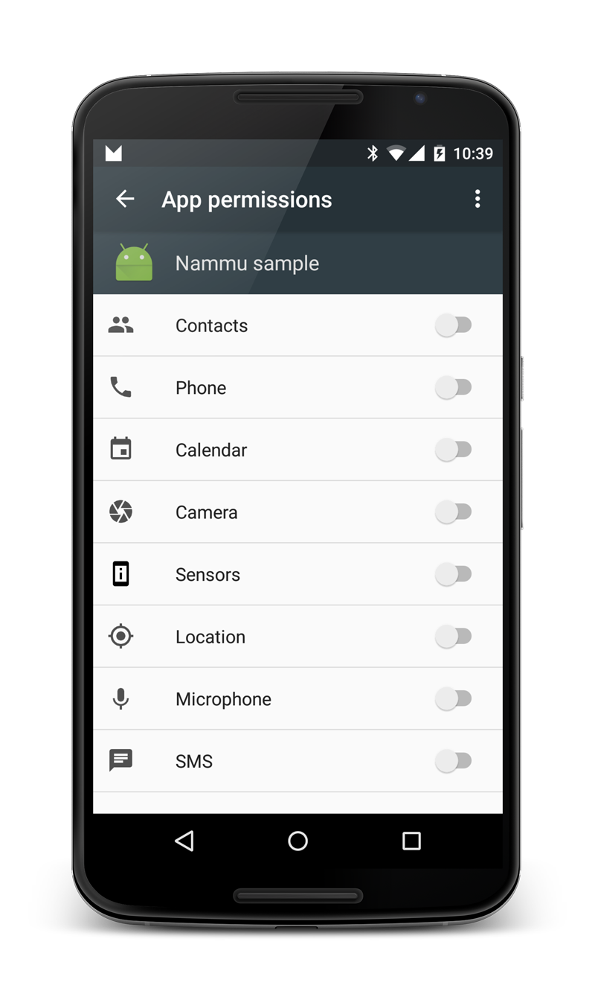

Nammu - Runtime Permission Helper
=======
[](https://jitpack.io/#tajchert/Nammu) [](https://jitci.com/gh/tajchert/Nammu)

Speed up your work with new Runtime Permissions introduced in Android 6.0 Marshmallow. This lib allows you to monitor permissions, check them in background and as well ask for a permission in easy way (callback).

### What are Runtime Permissions?
Google docs is [here](https://developer.android.com/training/permissions/requesting.html).
TLDR: like old-loved permissions that were ask during installation but this time they are more dynamic (should be ask only when they are needed) and can be revoked by user at any time.



### Why should I care?
Because your user can revoke most essential part of your app and quite probably there will be a lot of app crashes.
Current solution you can see here - [Google sample](https://github.com/googlesamples/android-RuntimePermissions) basically there is a lot that happens with Activity that is used to check and grant permissions. Also permissions rights are checked many times in the code.

### Monitor permissions
To keep track of access to particular permissions, all you need is init Nammu `Nammu.init(Context);` (pass Application Context, not Activity Context) and call `permissionCompare(PermissionListener)` to compare lists of granted permissions with previous method call. If you want only to update granted permission lists (without checking if anything changed) use `refreshMonitoredList()`. PermissionListener offers a callback when permissions was changed, removed, or added. It is recommended to do on app start to check if user didn't removed any permissions and open our app again.

Also you can add Permission to ignored list to ignore its changes in access - use `ignorePermission(String permission)`.


### Easy asking for permissions
It removes a bit of boiler plate to keep request id, and thus simplify your code inside Activity class.
call `Nammu.askForPermission(Activity, PermissionString , PermissionCallback)` which offers a nice callback with either success or fail method. To use this only thing you need to add is in your Activity that you are using.

```java
@Override
public void onRequestPermissionsResult(int requestCode, String[] permissions, int[] grantResults) {
    Nammu.onRequestPermissionsResult(requestCode, permissions, grantResults);
}
```

### Extras
You can get list of monitored Permissions -`Nammu.getPrevPermissions()`, list of currently granted permissions - `getGrantedPermissions()`, and few less important.

### How to import it?
It is available on jitpack.io by adding this to your build.gradle:

```groovy
repositories {
    maven {
        url "https://jitpack.io"
    }
}

dependencies {
    compile 'com.github.tajchert:nammu:1.5.1'
}
```
### AndroidX, Kotlin...
Android X was added in 1.3.0, last build without it is 1.2.4, Kotlin since 1.4.0.
